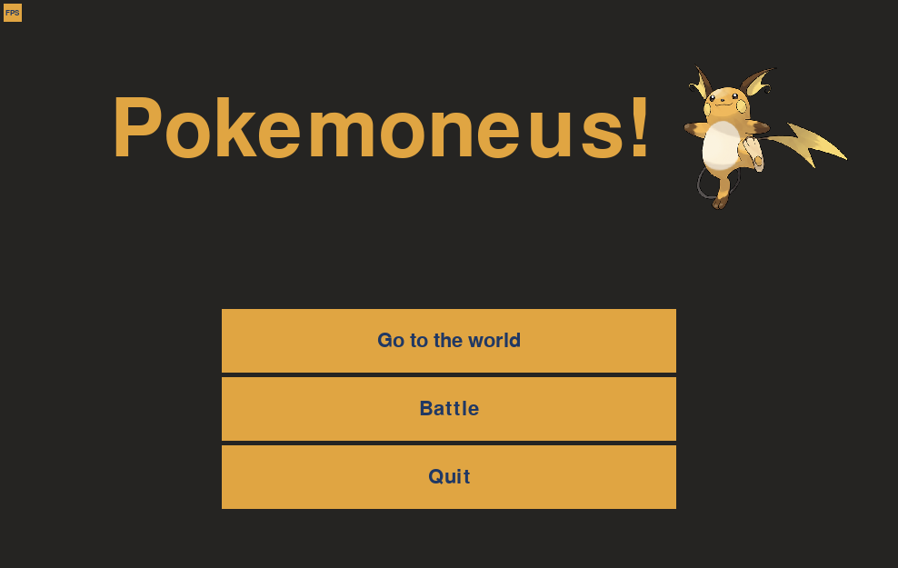

# Pokemoneus!
- Collect *pokemons*
- Fight with other *trainers*
- Become **the best**!

> A school project dedicated to OOP and design patterns

## Installation & Usage

1. Clone the repo
   ```sh
   git clone https://github.com/tosterabgx/pokemoneus.git && cd pokemoneus
   ```
2. Create a venv and activate it
   ```sh
   python -m venv .venv && source .venv/bin/activate
   ```
3. Install required packages
   ```sh
   pip install -r requirements.txt
   ```
4. Run the game
   ```sh
   cd pokemoneus
   python main.py
   ```

## Technologies Used


*That's it, it's pretty lightweight!*

Also, I used **facade** and **state** patterns, so I hope to get a high grade :)

## Bugs fixed:
- Pokemons clipping through the borders of the window
- Hitboxes of pokemons in the world being shifted to the right
- The other trainer's damaged pokemons did not restored after re-entering the battle

---
## Screenshot(s)


## Results
> [!NOTE]
> Also checkout pokemoneus.pdf! Those were my slides for the presentation.

**The grade I got: TBD**